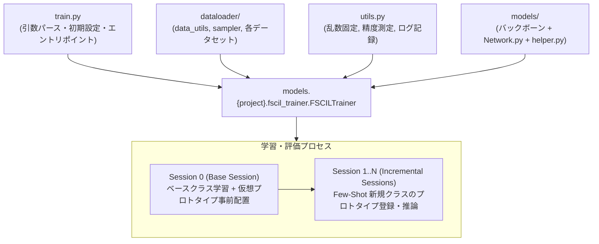
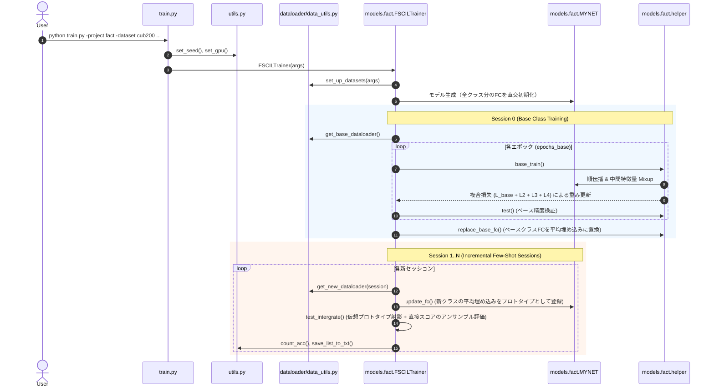

# FACT (Forward Compatible Few-Shot Class-Incremental Learning) コード解説

本リポジトリは、CVPR 2022 論文 **"Forward Compatible Few-Shot Class-Incremental Learning" (FACT)** の公式 PyTorch 実装です。

Few-Shot Class-Incremental Learning (FSCIL) は、最初に十分なデータがあるベースクラス（Session 0）で事前学習を行い、以降のセッション（Session 1〜N）でごく少数のサンプル（Few-shot）から新規クラスを逐次学習しつつ、過去のクラスを忘却（Catastrophic Forgetting）しないことを目指すタスクです。

FACT は、従来の「過去のモデルを維持する（Retrospective）」アプローチに対し、**「将来の新規クラス更新に備えてあらかじめ埋め込み空間に余白を確保する（Prospective / Forward Compatible）」** というアプローチを提案しています。

---

## 目次

1. [全体アーキテクチャ概要](#全体アーキテクチャ概要)
2. [train.py の詳細](#1-trainpy)
3. [utils.py の詳細](#2-utilspy)
4. [dataloader/ ディレクトリの詳細](#3-dataloader-ディレクトリ)
5. [models/ ディレクトリの詳細](#4-models-ディレクトリ)
   - 4.1. バックボーンネットワーク (`resnet20_cifar.py`, `resnet18_encoder.py`)
   - 4.2. ベースライン実装 (`models/base/`)
   - 4.3. FACT 提案手法実装 (`models/fact/`)
6. [全体の実行フロー](#全体の実行フロー)

---

## 全体アーキテクチャ概要



---

## 1. `train.py`

### 概要
実験の実行エントリポイントです。コマンドライン引数の解析、乱数シードの設定、GPU環境の初期化を行い、指定されたプロジェクト（`base` または `fact`）のトレーナーを動的にロードして学習・評価を開始します。

### 主な引数・パラメータ一覧
| 引数名 | デフォルト値 | 説明 |
| :--- | :--- | :--- |
| `-project` | `'base'` | 使用するモデル実装 (`base`: ベースライン, `fact`: 提案手法) |
| `-dataset` | `'cub200'` | 対象データセット (`cifar100`, `cub200`, `mini_imagenet` 等) |
| `-dataroot` | `'data/'` | データセットが保存されているルートディレクトリ |
| `-epochs_base` | `100` | ベースセッション (Session 0) の学習エポック数 |
| `-epochs_new` | `100` | インクリメンタルセッションで微調整を行う場合のエポック数 |
| `-lr_base` / `-lr_new` | `0.1` | ベース学習 / 新規セッション学習時の初期学習率 |
| `-schedule` | `'Step'` | 学習率スケジューラ (`Step`, `Milestone`, `Cosine`) |
| `-temperature` | `16` | コサイン類似度分類器で適用する温度パラメータ $\tau$ |
| `-base_mode` | `'ft_cos'` | ベース学習の分類器種別 (`ft_dot`: 内積, `ft_cos`: コサイン類似度) |
| `-new_mode` | `'avg_cos'` | 新規セッション時の分類器更新手法 (`avg_cos`: 平均埋め込みプロトタイプ + コサイン分類器) |
| `-balance` | `1.0` | FACT 損失関数の補助損失の重み係数 |
| `-loss_iter` | `200` | FACT 補助損失の適用を開始するエポック (Warm-up 期間の制御) |
| `-alpha` | `2.0` | 仮想インスタンス生成（Mixup）における Beta 分布のパラメータ |
| `-eta` | `0.1` | FACT 推論時の仮想プロトタイプ射影スコアの重み係数 $\eta$ |
| `-gpu` | `'0,1,2,3'` | 使用する GPU の ID リスト |
| `-seed` | `1` | 再現性のための乱数シード |

### 処理の流れ
1. `get_command_line_parser()` で引数をパース。
2. `set_seed(args.seed)` により乱数シードを固定。
3. `set_gpu(args)` で環境変数 `CUDA_VISIBLE_DEVICES` を設定。
4. `importlib.import_module('models.%s.fscil_trainer' % (args.project))` を使って動的にトレーナークラス (`FSCILTrainer`) をインポート。
5. `trainer.train()` を実行。

---

## 2. `utils.py`

### 概要
学習・評価・ログ収集において汎用的に使用される補助関数およびクラス群を定義しています。

### 主な関数・クラス
- **`set_seed(seed)`**:
  - Python 標準の `random`、`numpy`、`torch` (CPU/GPU) の乱数シードを一括設定。
  - `seed != 0` の場合は `torch.backends.cudnn.deterministic = True` かつ `torch.backends.cudnn.benchmark = False` に設定し、完全な再現性を確保。
- **`set_gpu(args)`**:
  - コマンドライン引数から指定された GPU ID を環境変数 `CUDA_VISIBLE_DEVICES` に登録し、使用 GPU 数を返す。
- **`ensure_path(path)`**:
  - 指定されたディレクトリが存在しない場合、自動的に `os.makedirs(path)` で作成。
- **`Averager` クラス**:
  - 損失値や認識精度などの累積平均をオンライン計算するユーティリティクラス（`add(x)` で更新、`item()` で平均値取得）。
- **`Timer` クラス**:
  - セッションやエポックの経過時間を計測し、秒 (`s`)・分 (`m`)・時間 (`h`) 形式でフォーマット出力。
- **`count_acc(logits, label)`**:
  - Top-1 分類精度を計算（CPU/CUDA 両対応）。
- **`count_acc_topk(x, y, k=5)`**:
  - Top-$k$ 分類精度を計算。
- **`count_acc_taskIL(logits, label, args)`**:
  - Task-Incremental Learning（各クラスがどのセッションに属するかを既知としてマスク処理した上での精度）を評価。
- **`confmatrix(logits, label, filename)`**:
  - モデルの予測結果から混同行列（Confusion Matrix）を計算し、`matplotlib` を用いて PDF 形式で可視化・保存。
- **`save_list_to_txt(name, input_list)`**:
  - リストデータを改行区切りでテキストファイルに保存。

---

## 3. `dataloader/` ディレクトリ

### 概要
FSCIL における段階的（セッションごと）なデータの読み込み、データ拡張、Few-shot エピソードのサンプリングを管理します。

```
dataloader/
├── data_utils.py          # データセット設定・ローダー生成の統合モジュール
├── sampler.py             # N-way K-shot 抽出用の各種サンプラー
├── cifar100/
│   ├── cifar.py           # CIFAR-100 Dataset クラス
│   └── autoaugment.py     # CIFAR 用 AutoAugment 実装
├── cub200/
│   ├── cub200.py          # CUB-200-2011 鳥類 Dataset クラス
│   └── autoaugment.py     # CUB 用 AutoAugment 実装
├── miniimagenet/
│   ├── miniimagenet.py    # miniImageNet Dataset クラス
│   └── autoaugment.py     # ImageNet 用 AutoAugment 実装
├── imagenet100/           # ImageNet-100 用 Dataset クラス
└── imagenet1000/          # ImageNet-1000 用 Dataset クラス
```

### 主要ファイルの役割

#### `data_utils.py`
- **`set_up_datasets(args)`**:
  - データセット名（`cifar100`, `cub200`, `mini_imagenet`, `imagenet100`, `imagenet1000`）に応じて、以下の FSCIL 設定を `args` に自動設定：
    - `base_class`: ベースセッションで学習するクラス数（CIFAR100: 60, CUB200: 100, miniImageNet: 60, ImageNet1000: 600）
    - `num_classes`: 全クラス数（CIFAR100: 100, CUB200: 200, miniImageNet: 100, ImageNet1000: 1000）
    - `way`: 1セッションあたりに追加される新規クラス数（CIFAR100: 5, CUB200: 10, miniImageNet: 5）
    - `shot`: 新規クラスあたりの学習サンプル数（標準は 5-shot）
    - `sessions`: 総セッション数（ベースセッション含む）
- **`get_dataloader(args, session)`**:
  - `session == 0` の場合は `get_base_dataloader()` を、`session > 0` の場合は `get_new_dataloader()` を呼び出す。
- **`get_base_dataloader(args)`**:
  - Session 0（ベースクラス）の `trainset`（全量データ）、`trainloader`、およびベースクラスのみの `testloader` を作成。
- **`get_new_dataloader(args, session)`**:
  - Session 1 以降の新規クラス用学習データローダーと、**これまでに登場した全クラス（ベースクラス＋新クラスすべて）を含む累積評価用テストデータローダー** を作成。
  - 新規クラスのインデックスは `data/index_list/{dataset}/session_{session+1}.txt` から読み込む。

#### `sampler.py`
メタ学習スタイルの Few-shot タスクを構成するためのバッチサンプラー群：
- **`CategoriesSampler`**: 全クラスの中からランダムに $N$ クラス抽出し、各クラスから $K$ サンプルを抽出してバッチを形成。
- **`BasePreserverCategoriesSampler`**: 全クラスを網羅しつつ各クラスから指定数のサンプルをサンプリング。
- **`NewCategoriesSampler`**: 新規追加されたクラス範囲に限定して均等にサンプリング。

#### 各データセット実装 (`cifar100/`, `cub200/`, `miniimagenet/`)
- PyTorch の `Dataset` を継承し、指定されたクラスインデックス (`index`) またはインデックスリストファイル (`index_path`) に合致するサンプルのみをフィルタリングして保持。
- 訓練時には `autoaugment.py` やランダムクロップ・水平反転などを適用し、テスト時にはリサイズ・センタリング・標準化のみを適用。

---

## 4. `models/` ディレクトリ

### 概要
特徴抽出器（バックボーン）、分類器（FC層）、およびベースラインと提案手法（FACT）のトレーナーロジックを格納しています。

```
models/
├── resnet20_cifar.py       # CIFAR-100 用 ResNet-20 エンコーダ
├── resnet18_encoder.py     # CUB-200 / miniImageNet 用 ResNet-18 エンコーダ
├── base/                   # 標準的な FSCIL ベースライン実装
│   ├── base.py             # 抽象基底 Trainer クラス
│   ├── Network.py          # コサイン類似度 / 線形分類器ネットワーク
│   ├── helper.py           # ベースライン学習・テストループ
│   └── fscil_trainer.py    # ベースライン用 FSCILTrainer
└── fact/                   # FACT (CVPR 2022) 提案手法実装
    ├── base.py             # 抽象基底 Trainer クラス
    ├── Network.py          # 仮想プロトタイプ事前確保対応ネットワーク
    ├── helper.py           # FACT 複合損失（Mixup + 仮想プロトタイプ損失）
    └── fscil_trainer.py    # FACT 用 FSCILTrainer（フォワードコンパチビリティ推論）
```

---

### 4.1. バックボーンネットワーク

1. **`resnet20_cifar.py`**:
   - CIFAR-100 などの小解像度（$32 \times 32$）画像向けに最適化された軽量 ResNet。
   - 3つのステージ（チャネル数: 16 $\to$ 32 $\to$ 64）で構成され、最終特徴量は **64次元**。
2. **`resnet18_encoder.py`**:
   - miniImageNet や CUB-200 向けの高解像度 ResNet-18（4ステージ、出力特徴量 **512次元**）。
   - CUB-200 では ImageNet 事前学習済み重み（`pretrained=True`）をロードして使用可能。
   - FACT で中間層での特徴量合成を行うため、`pre_encode`（浅い層）と `post_encode`（深い層）に分割して順伝播できる構造を備える。

---

### 4.2. ベースライン実装 (`models/base/`)

- **`Network.py`**:
  - `MYNET` クラス。バックボーン特徴量とクラス重みベクトル間のコサイン類似度（Cosine Classifier）または内積（Dot Classifier）でロジットを計算：
    $$\text{logits} = \tau \cdot \frac{x}{\|x\|_2} \cdot \left(\frac{W}{\|W\|_2}\right)^T$$
  - **インクリメンタル更新 (`update_fc_avg`)**:
    - 新規クラスのデータを受け取った際、そのクラスのサンプル特徴量の平均ベクトル（Prototype）を計算し、分類器の重み $W$ に直接代入：
      $$W_c = \frac{1}{|S_c|} \sum_{x \in S_c} f(x)$$
- **`fscil_trainer.py` / `helper.py`**:
  - Session 0 で Cross-Entropy 損失を用いてバックボーンとベースクラス分類器を通常学習。
  - Session 1 以降はバックボーンを固定し、プロトタイプ登録（または少エポックの微調整）により新規クラスを追加。

---

### 4.3. FACT 提案手法実装 (`models/fact/`)

FACT の中核アルゴリズムが実装されています。

#### ① `models/fact/Network.py`
- **仮想プロトタイプ（Virtual Prototypes）の事前割り当て**:
  - 分類器の重み行列 $W$ を、初期化時点で全クラス分（`pre_allocate = args.num_classes`）確保し、`nn.init.orthogonal_` により直交初期化。
  - 新規クラス用の領域を `dummy_orthogonal_classifier` として固定し、ベースクラス学習時に未知クラス用の「予約席」として機能させる。
- **2段階エンコード (`pre_encode` / `post_encode`)**:
  - 特徴量レベルでの Mixup を実行するため、畳み込み層の途中で処理を分割。

#### ② `models/fact/helper.py` (`base_train`)
Session 0 のベース学習時、以下の 4 つの損失からなる複合損失でモデルを最適化します：
$$\mathcal{L}_{\text{total}} = \mathcal{L}_{\text{base}} + \text{balance} \cdot (\mathcal{L}_2 + \mathcal{L}_3 + \mathcal{L}_4)$$

1. **$\mathcal{L}_{\text{base}}$ (標準分類損失)**:
   - ベースクラスに対する通常の Cross-Entropy 損失。
2. **$\mathcal{L}_2$ (仮想プロトタイプ割り当て損失)**:
   - ベースクラスのサンプルが持つ埋め込み空間を過剰に広げず圧縮し、仮想プロトタイプ方向へのマージンを空けるための損失。
3. **$\mathcal{L}_3$ (仮想インスタンス分類損失)**:
   - `pre_encode` された中間特徴量同士を Beta 分布に基づく係数 $\beta$ でランダム Mixup し、未知クラスの疑似サンプルを生成。
   - 生成された疑似サンプルを仮想プロトタイプ（新規クラス領域）へ割り当てて学習。
4. **$\mathcal{L}_4$ (仮想インスタンスのベースクラス分離損失)**:
   - 疑似サンプルがベースクラスの領域を侵食しないように分離を強制。

#### ③ `models/fact/fscil_trainer.py` (`test_intergrate`)
新規セッション時の推論において、直接のプロトタイプ分類スコアだけでなく、事前に確保した仮想プロトタイプ空間への射影情報（フォワードコンパチビリティ）を活用したアンサンブル推論を実施します：
- **射影行列の構築**:
  $$\text{proj\_matrix} = \text{dummy\_classifiers} \times W_{:\text{test\_class}}^T$$
- **統合推論**:
  $$\text{logits} = \eta \cdot \text{Softmax}(\text{logits}_{\text{proj}}) + (1 - \eta) \cdot \text{Softmax}(\text{logits}_{\text{direct}})$$
これにより、Few-shot の新規クラスに対しても頑健で偏りの少ない予測が可能となります。

---

## 全体の実行フロー


